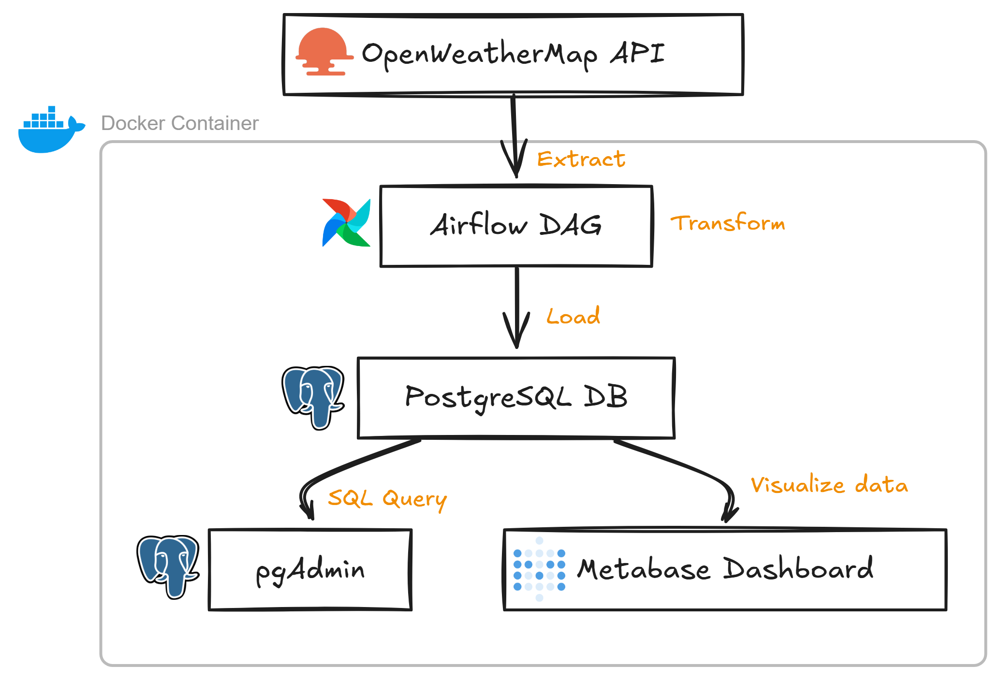

# 🌦️ NZ Weather Data Pipeline with Airflow, Docker, PostgreSQL & Metabase

This project is an end-to-end data pipeline that collects weather data for 10 cities across New Zealand using the OpenWeatherMap API, processes and stores the data in PostgreSQL through Apache Airflow, and visualises the results using Metabase.

The project demonstrates the basic workflow of an ETL data pipeline, including data extraction, transformation and loading, as well as workflow scheduling and data visualisation.

---

## 🛠️ Tech Stack

- **Python** – Data extraction and processing
- **Apache Airflow** – ETL orchestration and scheduling
- **PostgreSQL** – Data storage
- **Docker & Docker Compose** – Containerisation
- **pgAdmin** – PostgreSQL database management
- **Metabase** – Data visualisation
- **OpenWeatherMap API** – Weather data source

---

## 🎯 Objective

The main objective of this project is to demonstrate how an automated data pipeline can collect data from an external API, process and store it in a relational database, and make the data available for analysis and visualisation.

## 🧱 Architecture

The pipeline follows this basic flow:

OpenWeatherMap API  
↓  
Apache Airflow  
↓  
PostgreSQL  
↓  
Metabase

Additional tools:

- Docker – runs the services in containers
- pgAdmin – provides a graphical interface for PostgreSQL

### Visual Architecture

<p align="center">
  
</p>

---

## 🌏 Cities Covered

The pipeline collects weather information for 10 New Zealand cities:

- Auckland
- Wellington
- Christchurch
- Hamilton
- Tauranga
- Dunedin
- Palmerston North
- Napier
- Nelson
- Rotorua

---

## 📊 Data Collected

The pipeline collects weather information including:

- City
- Temperature
- Humidity
- Weather description
- Date

---

## 🔄 ETL Pipeline

### Extract

Weather data is retrieved from the OpenWeatherMap API for the selected New Zealand cities.

### Transform

The retrieved weather information is processed and structured into the required fields.

### Load

The processed data is inserted into a PostgreSQL database.

Apache Airflow is used to automate and schedule the pipeline.

---

## 📈 Data Visualisation

Metabase is used to create visualisations from the PostgreSQL weather data.

The dashboard includes visualisations such as:

- Average temperature
- Average humidity
- Number of cities
- Weather conditions across NZ cities

---

## 🐳 Docker Services

The project uses Docker Compose to run the following services:

| Service | Purpose |
|---|---|
| Airflow | ETL orchestration and scheduling |
| PostgreSQL | Data storage |
| pgAdmin | Database management |
| Metabase | Data visualisation |

---

## 🚀 Setup Instructions

1. **Clone the repository**
   ```bash
   git clone YOUR_GITHUB_REPOSITORY_URL
   cd nz-weather-data-pipeline

2. **Create your .env file**
   ```bash
   cp .env.example .env

Then open .env and update the passwords of your choice and replace with your API key.

Sign in/Create account on open weather website and copy your API key. You can get your API key from  [here](https://openweathermap.org/current). 

3. **Start the services**
   ```bash
   docker compose up --build

4. **Access the tools**
- **Airflow:** http://localhost:8080
- **pgAdmin:** http://localhost:5050
- **Metabase:** http://localhost:3000

For logging in, credentials set in .env file are used.

Run DAGs using Airflow, Query Database using pgAdmin and Visualize data using Metabase.

---

## 📚 Key Learning Outcomes

Through this project, I gained practical experience with:

- Building an ETL pipeline
- Working with REST APIs
- Apache Airflow DAGs
- PostgreSQL
- Docker and Docker Compose
- Database management using pgAdmin
- Data visualisation using Metabase
- Environment variables and basic credential management
- Scheduling automated data workflows

## Author
   Built by [Sarabjeet Patel](https://github.com/sarabjeet-patel)

   